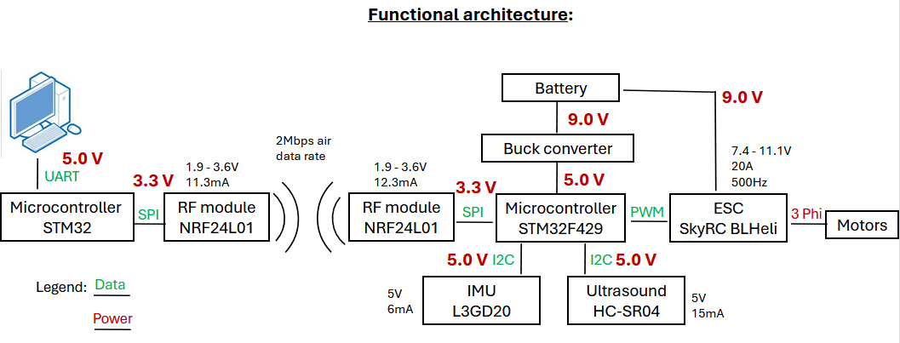

This folder contains 3D models and STL files required to assemble the drone frame.  
The parts are designed for a quadcopter configuration with 4 motors.

Within this folder you will find .stl files (for 3D printing) and .step files (3D modeling) for the buck regulator, ultrasonic sensor, and battery holder.

Drone schematic:

Things to improve:
Wire management, mounting for IEC boards, potential PCB shield, and reprint mounting for STM32 and IMU