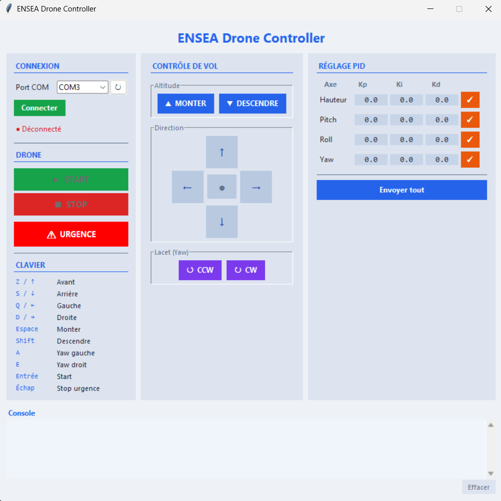

# ENSEA Drone Controller — Interface graphique PC

Interface de contrôle du drone ENSEA développée en Python/Tkinter.
Elle communique avec le drone via un **STM32 émetteur NRF24L01** connecté en USB.

---

## Prérequis

- Python 3.10+
- Bibliothèque `pyserial`

```bash
pip install -r requirements.txt
```

---

## Lancement

```bash
python main.py
```

---

## Architecture du code

```
.
├── main.py               # Point d'entrée
├── config.py             # Constantes (baudrate, palette, axes PID)
├── serial_comm.py        # Classe DroneSerial — communication UART
├── flight_commands.py    # Classe FlightCommands — construction des trames
├── requirements.txt
└── ui/
    ├── app.py            # Fenêtre principale — orchestre les panneaux
    ├── connection_panel.py  # Panneau gauche : connexion + boutons drone
    ├── control_panel.py     # Panneau centre : dpad, altitude, yaw
    ├── pid_panel.py         # Panneau droite : coefficients PID
    └── console_panel.py     # Bas de page : log série scrollable
```

---

## Protocole de communication

Le PC envoie des trames ASCII via UART (115 200 baud) au STM32 émetteur,
qui les retransmet au drone par radio NRF24L01+ (2,4 GHz, 250 kbps).

### Trames de vol — `$ABCDEFGH`

Trame de 9 caractères, chaque lettre vaut `'0'` ou `'1'` :

| Position | Action         |
|----------|----------------|
| `[1]`    | Monter         |
| `[2]`    | Descendre      |
| `[3]`    | Avant (pitch+) |
| `[4]`    | Arrière        |
| `[5]`    | Gauche (roll+) |
| `[6]`    | Droite         |
| `[7]`    | Yaw CCW        |
| `[8]`    | Yaw CW         |

Exemples :
```
$10000000   → monter
$00110000   → avant + gauche
$11111111   → arrêt d'urgence
```

### Commandes spéciales

| Trame    | Effet                           |
|----------|---------------------------------|
| `$start` | Initialisation + passage en vol |
| `$stop`  | Atterrissage / arrêt moteurs    |

### Modification PID — `*[axe][coeff][valeur]`

Format : `*` + axe (1 char) + coefficient (1 char) + valeur (6 chars)

| Axe | Description | Coeff | Description |
|-----|-------------|-------|-------------|
| `H` | Hauteur     | `P`   | Kp          |
| `P` | Pitch       | `I`   | Ki          |
| `R` | Roll        | `D`   | Kd          |
| `Y` | Yaw         |       |             |

Exemple : `*HP0.5000` → Kp Hauteur = 0.5

---

## Contrôles clavier

| Touche      | Action           |
|-------------|------------------|
| `Z` / `↑`  | Avant            |
| `S` / `↓`  | Arrière          |
| `Q` / `←`  | Gauche           |
| `D` / `→`  | Droite           |
| `Espace`    | Monter           |
| `Shift`     | Descendre        |
| `A`         | Yaw gauche (CCW) |
| `E`         | Yaw droit (CW)   |
| `Entrée`    | Start drone      |
| `Échap`     | Arrêt d'urgence  |

---

## Configuration série

| Paramètre | Valeur  |
|-----------|---------|
| Baud rate | 115 200 |
| Data bits | 8       |
| Stop bits | 1       |
| Parité    | Aucune  |
| Fréquence | 20 Hz   |