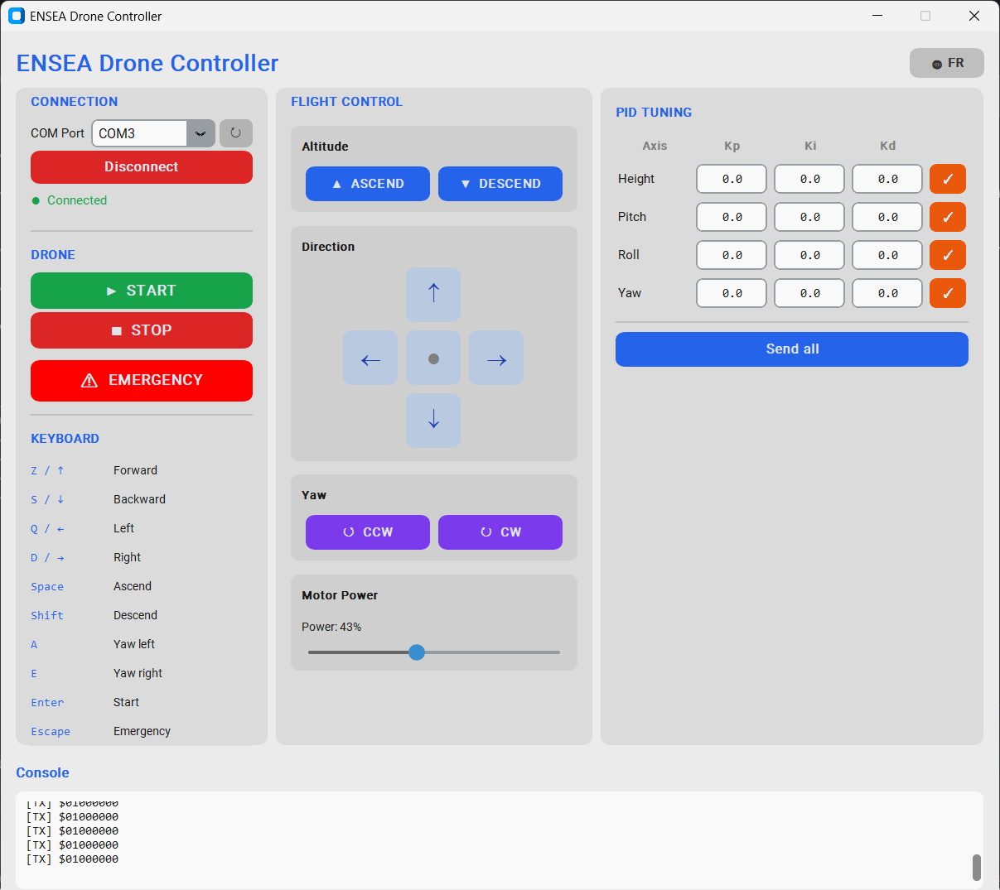

# ENSEA Drone Controller — Interface graphique PC

Interface de contrôle du drone ENSEA développée en Python/Tkinter.
Elle communique avec le drone via un **STM32 émetteur NRF24L01** connecté en USB.

---

## Prérequis

- Python 3.10+
- Bibliothèque `pyserial`

```bash
pip install -r requirements.txt
```

---

## Lancement

```bash
python main.py
```

---

## Architecture du code

```
.
├── main.py               # Point d'entrée
├── config.py             # Constantes (baudrate, palette, axes PID)
├── serial_comm.py        # Classe DroneSerial — communication UART
├── flight_commands.py    # Classe FlightCommands — construction des trames
├── requirements.txt
└── ui/
    ├── app.py            # Fenêtre principale — orchestre les panneaux
    ├── connection_panel.py  # Panneau gauche : connexion + boutons drone
    ├── control_panel.py     # Panneau centre : dpad, altitude, yaw
    ├── pid_panel.py         # Panneau droite : coefficients PID
    └── console_panel.py     # Bas de page : log série scrollable
```

---

## Protocole de communication

Le PC envoie des trames **binaires** via UART (115 200 baud) au STM32 émetteur,
qui les retransmet au drone par radio NRF24L01+ (2,4 GHz, 250 kbps).

Toutes les trames font exactement `PAYLOAD_LENGTH` octets (padding `0x00`).
Le premier octet est toujours l'**identifiant de commande**.

---

### Trames de vol — `0x24` + 1 octet de bits

| Octet | Valeur      | Description              |
|-------|-------------|--------------------------|
| `[0]` | `0x24` (`$`) | Identifiant vol          |
| `[1]` | bits 7→0    | État de chaque axe       |

Mapping des bits de l'octet `[1]` :

| Bit | Axe            |
|-----|----------------|
| 7   | Monter (UP)    |
| 6   | Descendre      |
| 5   | Avant (pitch+) |
| 4   | Arrière        |
| 3   | Gauche (roll+) |
| 2   | Droite         |
| 1   | Yaw CCW        |
| 0   | Yaw CW         |

Exemples :
```
24 80   → monter        (0b10000000)
24 28   → avant+gauche  (0b00101000)
```

### Commandes spéciales

| Trame     | Effet                           |
|-----------|---------------------------------|
| `24 01`   | Initialisation + passage en vol |
| `24 02`   | Atterrissage / arrêt moteurs    |
| `24 FF`   | Arrêt d'urgence immédiat        |

### Puissance moteurs — `0x25` + 1 octet

| Octet | Valeur        | Description              |
|-------|---------------|--------------------------|
| `[0]` | `0x25` (`%`)  | Identifiant puissance    |
| `[1]` | `0x00–0x64`   | Puissance en % (0 à 100) |

Exemples :
```
25 00   → 0 %  (moteurs à l'arrêt)
25 32   → 50 %
25 64   → 100 % (pleine puissance)
```

Envoyée à chaque déplacement du slider **Motor Power** dans l'interface.

### Modification PID — `0x2A` + axe + coeff + float

| Octet   | Valeur         | Description                        |
|---------|----------------|------------------------------------|
| `[0]`   | `0x2A` (`*`)   | Identifiant PID                    |
| `[1]`   | `'H'/'P'/'R'/'Y'` | Axe (Hauteur/Pitch/Roll/Yaw)    |
| `[2]`   | `'P'/'I'/'D'`  | Coefficient                        |
| `[3-6]` | float IEEE 754 little-endian | Valeur numérique     |

Exemple : Kp Hauteur = 0.5 → `2A 48 50 00 00 00 3F`

---

## Correspondance GUI ↔ STM32

Cette section montre, pour chaque action dans l'interface, la trame envoyée
et le code C du drone (`mainloop.c`) qui la traite.

---

### ▲ Bouton "Monter" (ou touche `Espace`)

**Python — `flight_commands.py`**
```python
# L'état UP=True construit la trame binaire :
def build_frame(self) -> bytes:
    bits = sum(1 << (7 - i) for i, k in enumerate(self._keys) if k)
    return bytes([0x24, bits])
# → envoie b'\x24\x80\x00\x00\x00\x00\x00\x00' via UART
```

**STM32 — `mainloop.c`**
```c
// control_step() — exécuté toutes les 825 µs
if (validated_command[1]=='1' && validated_command[2]=='0') {
    height.command += height_step;          // consigne altitude +
    height.command = MIN(height.command, 1.5);
}
else if (validated_command[2]=='1' && validated_command[1]=='0') {
    height.command -= height_step;          // consigne altitude -
    height.command = MAX(height.command, 0);
}
```

---

### ↑ Bouton "Avant" (ou touche `Z`)

**Python** → envoie `24 20` (bit 5 = avant)

**STM32 — `mainloop.c`**
```c
// Pitch command extraction
if (validated_command[3]=='1' && validated_command[4]=='0') {
    pitch.command = 1;       // inclinaison avant
}
else if (validated_command[4]=='1' && validated_command[3]=='0') {
    pitch.command = -1;      // inclinaison arrière
}
else {
    pitch.command = 0;       // pas de pitch
}
```

---

### ↺ Bouton "Yaw CCW" (ou touche `A`)

**Python** → envoie `24 02` (bit 1 = yaw CCW)

**STM32 — `mainloop.c`**
```c
// Yaw command extraction
if (validated_command[7]=='1' && validated_command[8]=='0') {
    yaw.command += yaw_step;     // rotation gauche (CCW)
}
else if (validated_command[8]=='1' && validated_command[7]=='0') {
    yaw.command -= yaw_step;     // rotation droite (CW)
}
```

---

### ▶ Bouton "START" (ou touche `Entrée`)

**Python — `ui/app.py`**
```python
def _start_drone(self):
    self.drone.send_raw(CMD_START)    # → b'\x24\x01\x00...' via UART
```

**STM32 — `mainloop.c`**
```c
// command_handler() — appelé à chaque réception NRF24L01
case IDLE_STATE:
    if (strcmp(received_command, "$start") == 0) {
        state = INITIALIZE_STATE;   // lance initialize()
    }
    break;

// initialize() démarre les timers, les capteurs, active le PID
// puis passe en FLYING_STATE si tout est OK
```

---

### ■ Bouton "STOP"

**Python** → envoie `24 02`

**STM32 — `mainloop.c`**
```c
case FLYING_STATE:
    if (strcmp(received_command, "$stop") == 0) {
        state = STOP_STATE;
    }
    break;

// stop() coupe les PWM moteurs et arrête tous les timers
void stop() {
    motor_SetPower(&MOTOR_FRONT_RIGHT, 0);
    motor_SetPower(&MOTOR_FRONT_LEFT,  0);
    motor_SetPower(&MOTOR_BACK_RIGHT,  0);
    motor_SetPower(&MOTOR_BACK_LEFT,   0);
    // ...
}
```

---

### ⚠ Bouton "URGENCE" (ou touche `Échap`)

**Python** → envoie `24 FF`

**STM32 — `mainloop.c`**
```c
// Dans control_step(), vérifié à chaque cycle :
if (strcmp(validated_command, "$11111111") == 0) {
    flight_allowed = 0;     // coupe les moteurs immédiatement
}

// Si flight_allowed == 0 :
motor_SetPower(&MOTOR_FRONT_RIGHT, 0);
motor_SetPower(&MOTOR_FRONT_LEFT,  0);
motor_SetPower(&MOTOR_BACK_RIGHT,  0);
motor_SetPower(&MOTOR_BACK_LEFT,   0);
```

---

### ✓ Bouton PID (ex: Kp Hauteur = 0.5)

**Python — `ui/app.py`**
```python
def _send_pid_coeff(self, axis, coeff, raw_str):
    payload = bytes([0x2A, ord(axis), ord(coeff)]) + struct.pack('<f', float(raw_str))
    self.drone.send_raw(payload)
# → envoie b'\x2A\x48\x50\x00\x00\x00\x3F\x00' pour Kp Hauteur = 0.5
```

**STM32 — `mainloop.c`**
```c
case COEFFICENT_MODIFICATION_STATE:
    // validated_command = "*HP0.5000"
    // [1] = axe : H → heightPID
    // [2] = coeff : P → kp
    // [3..8] = "0.5000" → atof

    char value_string[6];
    for (int i = 0; i < 6; i++)
        value_string[i] = validated_command[i + 3];

    float value = atof(value_string);   // = 0.5

    switch (validated_command[2]) {
        case 'P': modified_pid->kp = value; break;
        case 'I': modified_pid->ki = value; break;
        case 'D': modified_pid->kd = value; break;
    }
    state = IDLE_STATE;
```

---

### 🎚 Slider "Motor Power"

**Python — `ui/app.py`**
```python
def _on_power_change(self, value: int):
    if not self.drone.is_connected():
        return
    # 0x25 = '%' comme identifiant, value = 0–100 sur 1 octet binaire
    self.drone.send_raw(bytes([0x25, value]))
# → envoie b'\x25\x32\x00...' pour 50 % via UART
```

> ⚠️ Le firmware STM32 doit être mis à jour pour interpréter le préfixe `%`
> et ajuster le PWM de base des moteurs en conséquence.

---

## Contrôles clavier

| Touche      | Action           |
|-------------|------------------|
| `Z` / `↑`  | Avant            |
| `S` / `↓`  | Arrière          |
| `Q` / `←`  | Gauche           |
| `D` / `→`  | Droite           |
| `Espace`    | Monter           |
| `Shift`     | Descendre        |
| `A`         | Yaw gauche (CCW) |
| `E`         | Yaw droit (CW)   |
| `Entrée`    | Start drone      |
| `Échap`     | Arrêt d'urgence  |

---

## Configuration série

| Paramètre | Valeur  |
|-----------|---------|
| Baud rate | 115 200 |
| Data bits | 8       |
| Stop bits | 1       |
| Parité    | Aucune  |
| Fréquence | 20 Hz   |